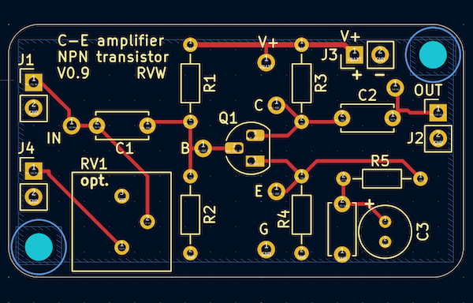

## C-E-amplifier
A simple common emitter amplifier board featuring an NPN transistor

## Overview

This is pretty much a textbook design for a common emitter (C-E) amplifier.
(see schematic below)

With the associated circuit board (PCB), one can easily construct
a circuit that can be powered up and tested.

The circuit board has the following features:
* through-hole (TH) pads make it easy to solder and easy to find components
* input and output "DC blocking" capacitors (with a standard 5mm lead spacing)
* fits commonly available NPN transistors with TO-92 package (2N3904, 2N2222, etc)
* optional input potentiometer (e.g. Bourns 3386P series)
* easy to power with 9V battery (using a battery clip)

## Schematic

## Circuit Board

